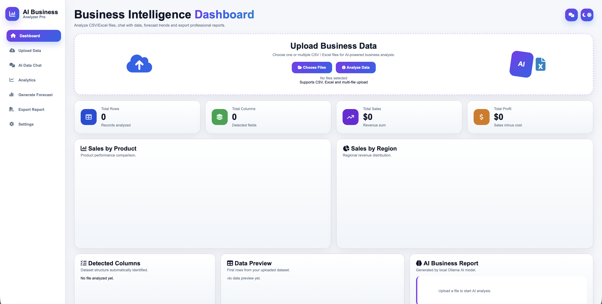
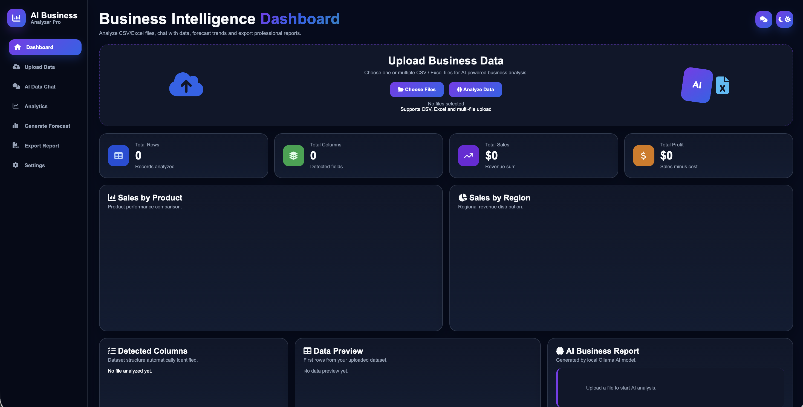
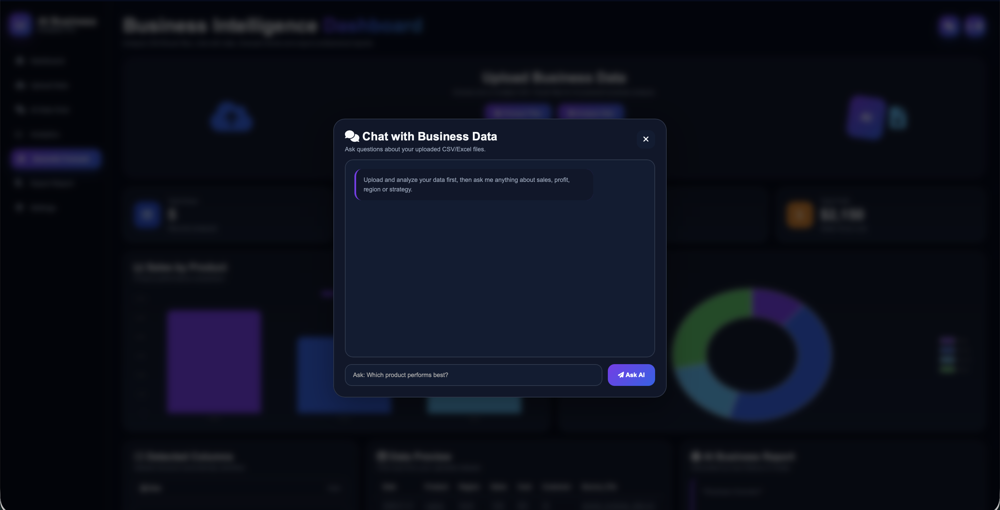
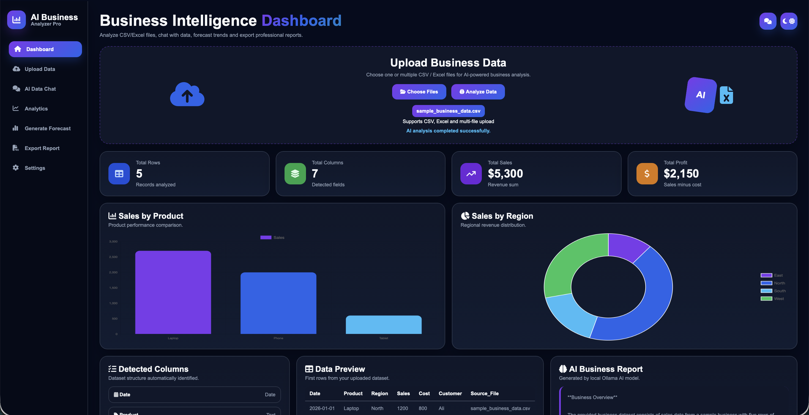

# AI Business Analyzer Pro 
Modern AI-powered Business Intelligence Dashboard built with:

- FastAPI
- Python
- HTML
- CSS
- JavaScript
- Chart.js
- jsPDF
- Ollama Local AI
- Modern SaaS UI

---

# Features 

- CSV Upload
- Excel Upload
- Multi-file Upload
- AI Business Insights
- AI Forecast Generator
- AI Chat with Business Data
- Sales Analytics Dashboard
- Sales by Product Charts
- Sales by Region Charts
- Professional PDF Export
- Light / Dark Mode
- Modern Sidebar UI
- Animated Dashboard
- Custom Alerts
- Responsive Design
- Local AI with Ollama
- No Paid API Required

---

# Screenshots 

## Light Dashboard



---

## Dark Dashboard



---

## AI Chat



---

## Dashboard Result



---

# Installation Guide (Mac)

## 1. Clone Repository

```bash
git clone https://github.com/baseetnaseri6/AI-Business-Analyzer.git
```

## 2. Open Project

```bash
cd AI-Business-Analyzer
```

## 3. Create Virtual Environment

```bash
python3 -m venv venv
```

## 4. Activate Environment

```bash
source venv/bin/activate
```

## 5. Install Requirements

```bash
pip install -r requirements.txt
```

OR manually:

```bash
pip install fastapi uvicorn pandas python-multipart requests openpyxl
```

## 6. Install Ollama

Download:

https://ollama.com/download/mac

Then install model:

```bash
ollama pull llama3.2
```

## 7. Run Backend

```bash
uvicorn backend.main:app --reload
```

Backend runs on:

```text
http://127.0.0.1:8000
```

## 8. Run Frontend

Open second terminal:

```bash
cd frontend
python3 -m http.server 5500
```

Open browser:

```text
http://localhost:5500
```

---

# Installation Guide (Windows)

## 1. Install Python

Download:

https://python.org

IMPORTANT:
Enable:

[x] Add Python to PATH

---

## 2. Install VS Code

Download:

https://code.visualstudio.com/

Install extensions:

- Python
- Live Server

---

## 3. Clone Repository

```bash
git clone https://github.com/baseetnaseri6/AI-Business-Analyzer.git
```

---

## 4. Open Project

```bash
cd AI-Business-Analyzer
```

---

## 5. Create Virtual Environment

```bash
python -m venv venv
```

---

## 6. Activate Environment

```bash
venv\Scripts\activate
```

---

## 7. Install Requirements

```bash
pip install -r requirements.txt
```

OR manually:

```bash
pip install fastapi uvicorn pandas python-multipart requests openpyxl
```

---

## 8. Install Ollama

Download:

https://ollama.com/download/windows

Install model:

```bash
ollama pull llama3.2
```

---

## 9. Run Backend

```bash
uvicorn backend.main:app --reload
```

---

## 10. Run Frontend

Open second terminal:

```bash
cd frontend
python -m http.server 5500
```

Open browser:

```text
http://localhost:5500
```

---

# Example CSV Format 

```csv
Date,Product,Region,Sales,Cost,Customer
2026-01-01,Laptop,North,1200,800,Ali
2026-01-02,Phone,South,900,500,Sara
2026-01-03,Tablet,East,600,350,Omar
2026-01-04,Laptop,West,1500,900,John
2026-01-05,Phone,North,1100,600,Mina
```

---

# Folder Structure 

```text
AI-Business-Analyzer
│
├── backend
│   └── main.py
│
├── frontend
│   ├── index.html
│   ├── style.css
│   └── script.js
│
├── screenshots
│   ├── light.png
│   ├── dark.png
│   ├── chat-ai.png
│   └── result.png
│
├── sample_business_data.csv
├── requirements.txt
├── README.md
├── LICENSE
└── .gitignore
```

---

# Future Features 

- Authentication System
- User Accounts
- Cloud Deployment
- Database Integration
- Advanced Forecasting
- AI Recommendations
- Real-time Analytics
- Team Collaboration
- API Integrations
- SaaS Subscription System

---

# Author 

Mohammad Baseet Naseri

- Data Scientist
- AI Engineer
- Full-Stack Developer

---

# License 

MIT License
